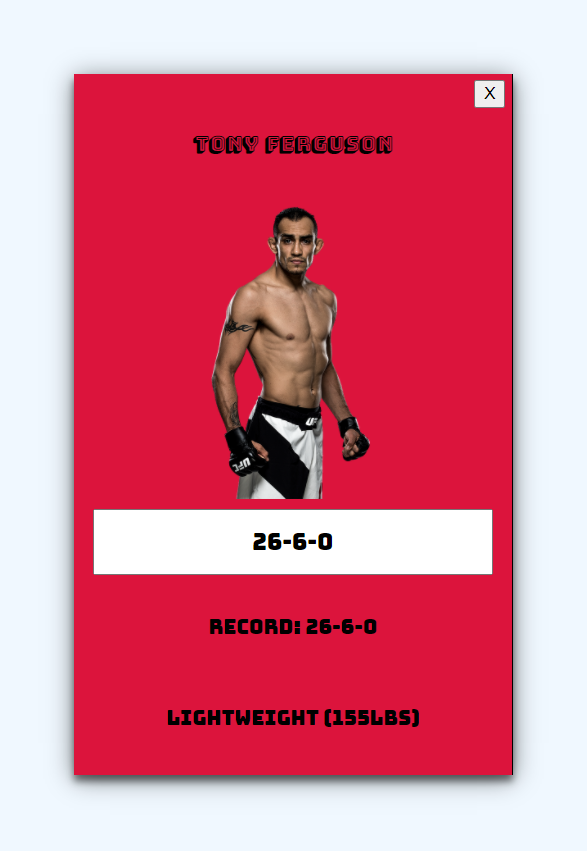

# Jake's Favorite Fighters
Jake's Favorite Fighters is an application that allows users to search through the entire historic UFC roster, view fighter stats (significant strike percentage, takedown accuracy, etc.) and submit a fighter form to build a "favorite fighters list".

## About
This application is a single page app with multiple client-side routes that allows users to view, change, or delete data from a json-server. The navigation menu links to the "Fighters Page" (the historic UFC roster), the "Favorite Fighters List" (user-submitted fighter profiles), and the "Add Fighter Form" which allows users to build their favorite fighter list.

## Frontend
To create this project I installed create-react-app globally with the following command:
```
npm install -g create-react-app
```
With the package installed I was then able to run the commands below to create the app framework and fire it up:
```
npx create-react-app my-app
cd my-app
npm start
```
I opted not to select a specific template in this case, instead using the base template. Because I used "npx create-react-app" npm was used to install dependencies. With a fresh project in place, the next steps were to create a db and start building components to make use of it.

## Components: An overview
The components used are as follows:
1. App.js 
2. Home.js
3. FavoriteFightersList.js (The list of fighters stored in the json-server)
4. FighterCard.js (Defines Favorite Fighter cards)
5. FightersForm.js (Add fighters to the Favorite Fighters List)
6. FightersPage.js (Lists the complete UFC roster)
7. RosterCard.js (Defines roster cards)
8. Search.js (Lets user search through the roster by name)

## Client-side routing
To create client-side routes I used React Router. Once imported, the following components made it possible to create the necessary routes and links to properly navigate through the app.
```
import { 
    BrowserRouter as Router, 
    Routes, 
    Route, 
    Link 
} from 'react-router-dom';
```

## Backend: Building the DB and accessing it
In order for users to submit chosen fighters to the "Favorite Fighters List" and to alter their records, I used a json-server to create a RESTful API. Unlike the historic roster which displays fighter statistics, the favorites list was made to include more descriptive/less analytical info, such as photos and weight classes. That data in db.json can be manipulated by the the user a number of ways with HTTP requests. Besides the initial GET request which grabs the data from db.json for display, a user may also:

- Add a totally new fighter to the favorites list via submission of a controlled form ("Add a Fighter Form") which initiates a **POST** request


- Change a fighter's record (Wins-Losses-Draws) by typing changes into the input field located under each Favorite Fighter's image, initiating a **PATCH** request


- Delete a fighter from the favorites list simply by clicking the [X] button on a card, initiating a DELETE request


## Styling: CSS
Rather than using inline-CSS to style the components I opted to create external CSS files for each component. 


## Credits
- Fighter images found at [pngimg.com](pngimg.com).
- Historic UFC roster dataset compiled by Rajeev Warrier on [Kaggle](https://www.kaggle.com/datasets/rajeevw/ufcdata?select=raw_fighter_details.csv).


## License
MIT
